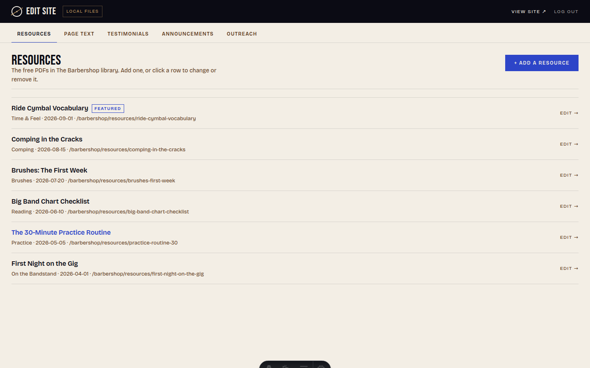
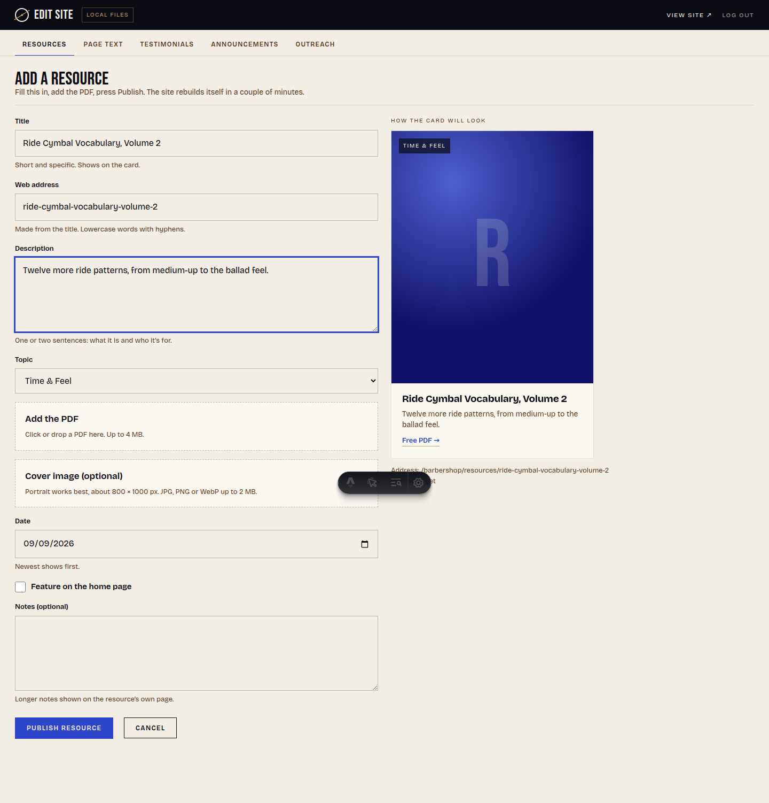
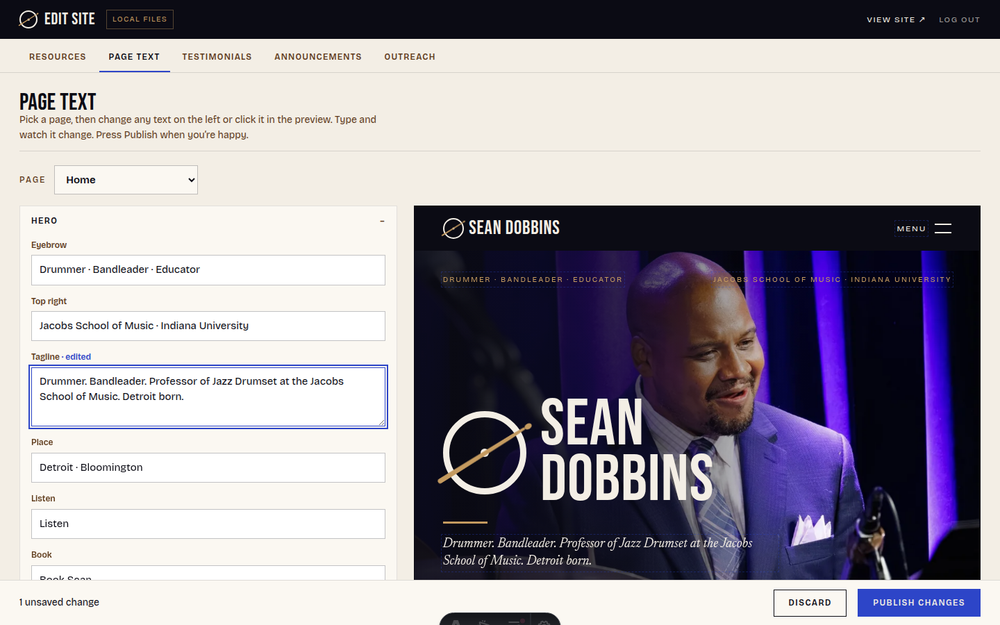
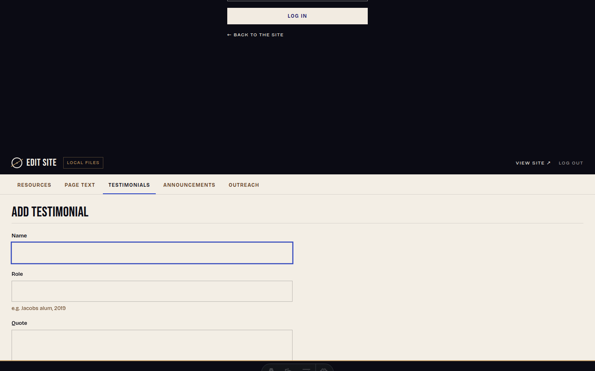

# Editing seandobbins.com — a guide for Sean

Everything you can change on the site lives in one place: **https://seandobbins.com/admin**
(the "Edit site" link in the footer of every page goes there too). One password, no accounts, nothing to install. Type, upload, press **Publish**. The site rebuilds itself in a couple of minutes and the editor tells you when your change is live.

If anything looks wrong, email Dana. Nothing you do in the editor can break the site, and every change is saved in the site's history so it can always be undone.

---

## 1. Logging in

Go to **seandobbins.com/admin** and enter the password Dana gave you. You stay logged in for a month on that device.


The tabs across the top are everything you can edit:

| Tab | What it changes |
|---|---|
| **Resources** | The free PDFs in The Barbershop library |
| **Page text** | Any text on any page, with a live preview |
| **Testimonials** | Quotes from students, parents and bandleaders |
| **Announcements** | The blue strip on the home page |
| **Outreach** | Clinics, masterclasses and residencies on the Outreach page |

---

## 2. Adding a resource (the main job)

Open **Resources** and press **+ Add a resource**.



Fill in the form. The card on the right shows how it will look as you type.



1. **Title**: short and specific. The web address is made from it automatically.
2. **Description**: one or two sentences. What it is, who it's for.
3. **Topic**: pick one. Visitors filter the library by topic.
4. **Add the PDF**: click the dashed box (or drag a file onto it). Up to 4 MB. If a PDF is bigger, export it again at a smaller size.
5. **Cover image**: optional. A portrait-shaped photo or graphic, about 800 × 1000 pixels, JPG or PNG. Without one, the card shows a blue tile with the first letter of the title, which looks fine.
6. **Date**: today, usually. Newest shows first.
7. **Feature on the home page**: tick this for the one resource you want on the home page.
8. Press **Publish resource**.

The bar at the bottom shows what's happening: *Uploading → Saved to GitHub → Building on Vercel → Live*. Building usually takes one to three minutes. You can keep working or close the tab; the change is already saved.

**To change a resource**: open Resources, click the row, edit, press Publish changes. You can replace the PDF or cover from the same form.
**To remove one**: open it and press *Remove this resource* at the bottom.

The email gate, the download link and the MailerLite tagging are automatic.

---

## 3. Changing text on any page

Open **Page text**, pick a page from the dropdown. The left column lists every piece of text on that page, grouped by section. The right side is the real page.



- **Type in any box** and the preview changes as you type.
- **Click any text in the preview** and the editor jumps to that box.
- Lists (the "played with" names, the discography, links) have **+ Add** and **Remove** buttons. Additions show on the site after publishing rather than in the preview.
- Edited boxes are marked. Press **Publish changes** in the bar at the bottom, or **Discard** to throw them away.
- The **Menu, footer & shared** page holds text that appears on every page: menu labels, footer, newsletter wording, the download pop-up.

Some things are deliberately not editable here: photos, layout, colours, the video and streaming links behind the Music page buttons (those are on the Music page's list), and the gig dates, which come from Sean's calendar. Ask Dana for those.

---

## 4. Testimonials, announcements, outreach

Each of these tabs works the same way: a list, a **+ Add** button, and a short form.



- **Testimonials**: name, role ("Jacobs alum, 2019"), the quote, an optional headshot, and an order number (lower shows first). The three placeholder ones on the site should be replaced.
- **Announcements**: title, date and a link. The newest one by date appears in the blue strip under the home page video.
- **Outreach**: institution, city, country, region, year, type, one-line note. The region decides which group it appears under. The three entries marked *SAMPLE* should be deleted once real ones are in.

---

## Good to know

- **Publish is the only button that matters.** Until you press it, nothing changes on the live site.
- **Wait for "Live"** in the bottom bar, then refresh the site. If it says it's still building after ten minutes, tell Dana.
- **Images**: JPG, PNG or WebP under 2 MB. **PDFs** under 4 MB.
- **Apostrophes, ampersands and accents** are fine to type; they come out exactly as written.
- Everything you publish is kept in the site's history forever, so mistakes can always be undone by Dana.

---
---

# For Dana — setup and internals

## How it works

The editor follows the "repository is the database" pattern: there is no CMS server. Every Publish is a git commit made through the GitHub API to the branch the deployment was built from; Vercel rebuilds; the editor polls the live site's `<meta name="build-commit">` (baked in at build from `VERCEL_GIT_COMMIT_SHA`) and reports *committed → building → live* only when the served build carries the new commit. Ten minutes without a match produces a diagnosis (failed build, or a URL that deploys from a different branch). If the deployment's branch differs from the branch being written to, the bar says so.

Pieces:

- `src/pages/admin.astro`: the editor. Static page, client-side app, global styles on purpose.
- `src/pages/api/admin/*`: `login`, `logout`, `session`, `file` (page copy read/apply-by-key), `collection` (list), `entry` (create/update/delete markdown entries), `blob` (stage an uploaded file as a git blob), `resource` (one commit with markdown + PDF + cover, or delete all three).
- `src/lib/admin/auth.ts`: constant-time password check, HttpOnly SameSite=Lax session cookie derived from an HMAC of the password, origin check on mutating requests, failed-attempt rate limit.
- `src/lib/admin/store.ts`: `GitHubStore` (Git Data API: blobs → tree → commit → ref) and `LocalStore` (working tree, dev only).
- `src/lib/admin/schema.ts`: the editable surface. Pages map to `src/content/copy/*.json`; collections and the resource form are declared here. Adding a field to a collection means adding it here and to `src/content.config.ts`.
- Page copy: every visible string is in `src/content/copy/<page>.json`, rendered through `<T k="page.section.key">` or an element with `data-edit="page.section.key"`. The live preview is the real page in a same-origin iframe; the editor updates matching `data-edit` elements as you type and listens for clicks to focus fields. Same-origin means no postMessage bridge and no scripts injected into public pages.

## One-time setup on Vercel

Environment variables (Project → Settings → Environment Variables), see `.env.example`:

- `ADMIN_PASSWORD`: the shared password. Change it here to log everyone out.
- `GITHUB_TOKEN`: see below.
- `GITHUB_REPO`: `vocalsbydana/seandobbins`.
- `DOWNLOAD_SECRET`: long random string (also used for the editor session).
- Leave "Automatically expose System Environment Variables" on; the editor relies on `VERCEL_GIT_COMMIT_SHA` and `VERCEL_GIT_COMMIT_REF`.
- Optional `CONTENT_BRANCH` if you ever want edits pinned to a branch other than the one deployed.

**GitHub token** (under your account for now; move it to Sean's once he has GitHub):
GitHub → Settings → Developer settings → Personal access tokens → **Fine-grained tokens** → Generate. Repository access: *Only select repositories* → this repo. Permissions: **Contents: Read and write**. Nothing else. Set an expiry you're comfortable with (a year is fine; put a reminder in your calendar, because when it expires Publish will fail with a GitHub 401 in the bottom bar). Paste it into `GITHUB_TOKEN` on Vercel and redeploy.

## Notes and limits

- **Uploads are capped at 4 MB per PDF and 2 MB per image** because Vercel functions cap request bodies at 4.5 MB. Bigger files would need an external store (Cloudflare R2 has a free 10 GB tier); not needed now.
- **The first programmatic save of a file** may reformat it slightly (JSON re-indented, frontmatter quoted). Harmless; the diff looks bigger than the edit once.
- **Rate limit and login attempts** are in-memory per function instance: good enough against casual abuse, not a security boundary. The password and the SameSite cookie are.
- **Concurrent edits**: page-copy saves re-fetch the file and apply changes by key, so two people editing different fields don't clobber each other. If nothing can be applied, the editor asks to reload.
- **Vercel Hobby limits**: each Publish is one build (a few minutes). Heavy editing days could approach the 100 builds/day soft limit; unlikely for this site.

## Local development

```
cp .env.example .env
# in .env: ADMIN_STORE=local  ADMIN_PASSWORD=anything  DOWNLOAD_SECRET=anything
npm install && npm run dev      # http://localhost:4321/admin edits the working tree, no GitHub needed
npm run build && npm run check
```

Note: in `astro dev`, writing a content file triggers a full page reload in the editor (Vite HMR). Production has no such reload.

## Auralis (gigs)

`src/components/AuralisFeed.astro` is the placeholder. It reads `src/data/gigs.sample.json` and renders hairline event rows with an add-to-calendar `.ics` link each. Replace the data source with the Auralis embed or API; keep the `{ id, title, venue, city, start, end?, url?, cta? }` shape.

## Still placeholder

- Discography rows (edit on the Music page in the editor).
- Apple Music, Bandcamp and Instagram links (`src/data/social.json`; unlinked icons show dimmed until `showUnlinked` is set to false).
- Three placeholder testimonials and three SAMPLE outreach entries (Sean, via the editor).
- The sixth photo (square profile with the Regal Tip stick) is not in the repo yet.
- MailerLite and Resend keys (see `.env.example`); without them the gate unlocks but records nobody and the contact form says it isn't set up.
