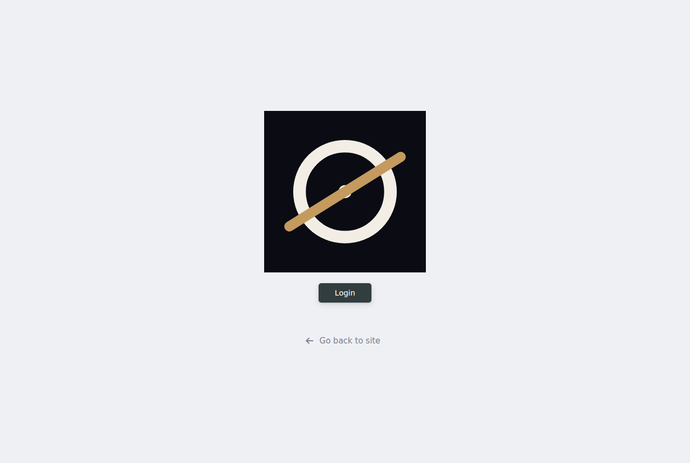
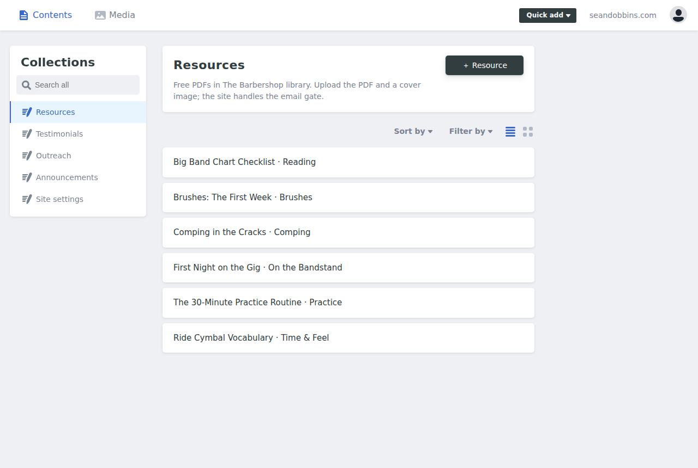
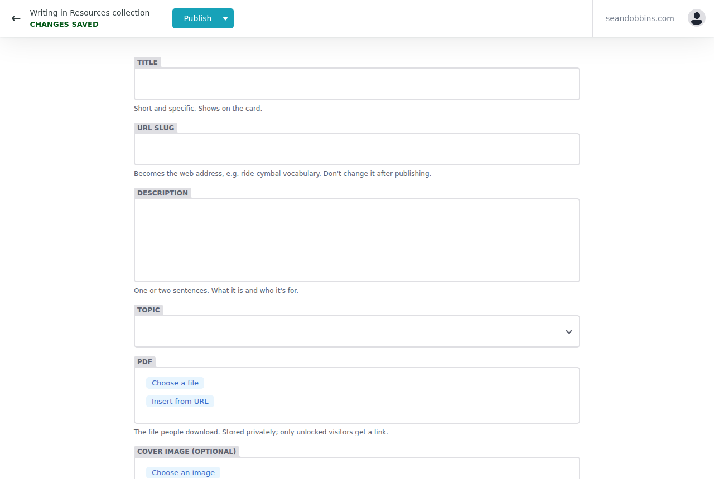
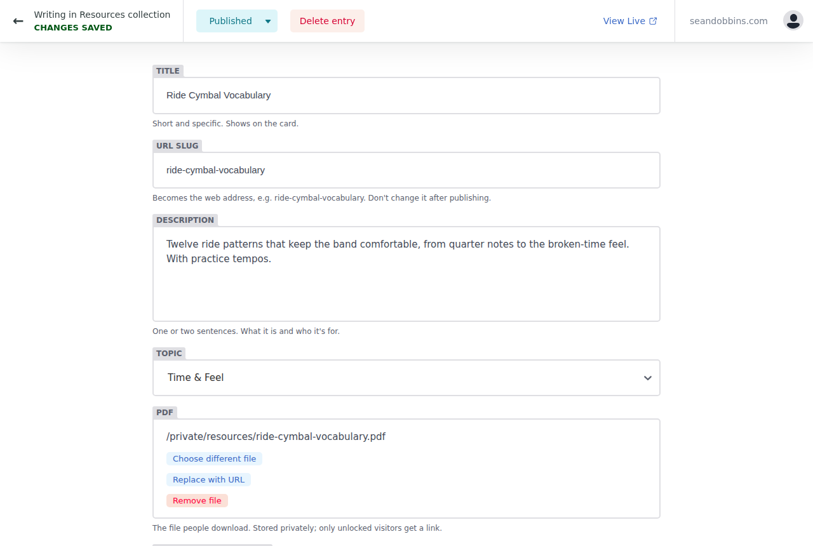
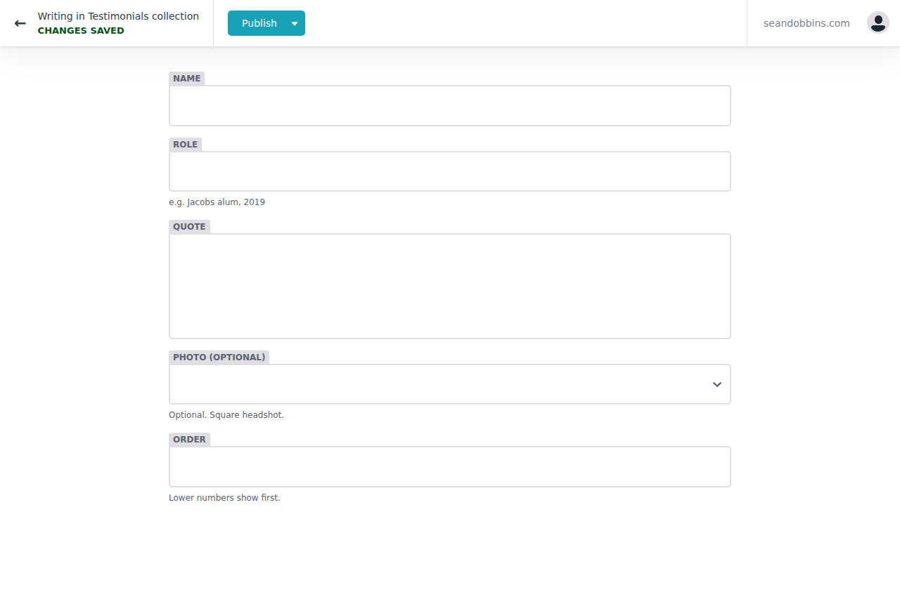
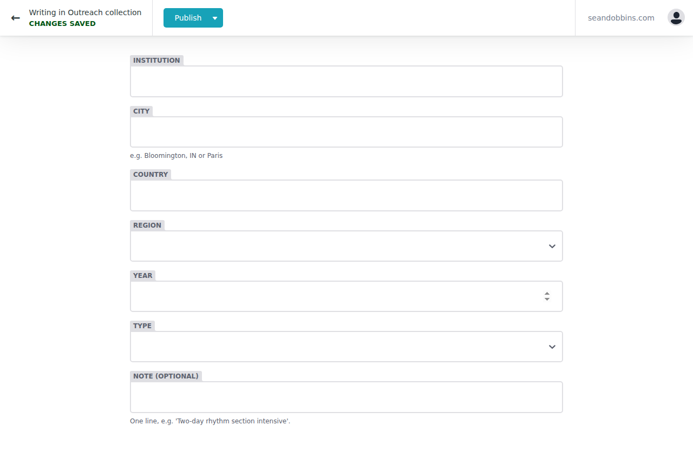
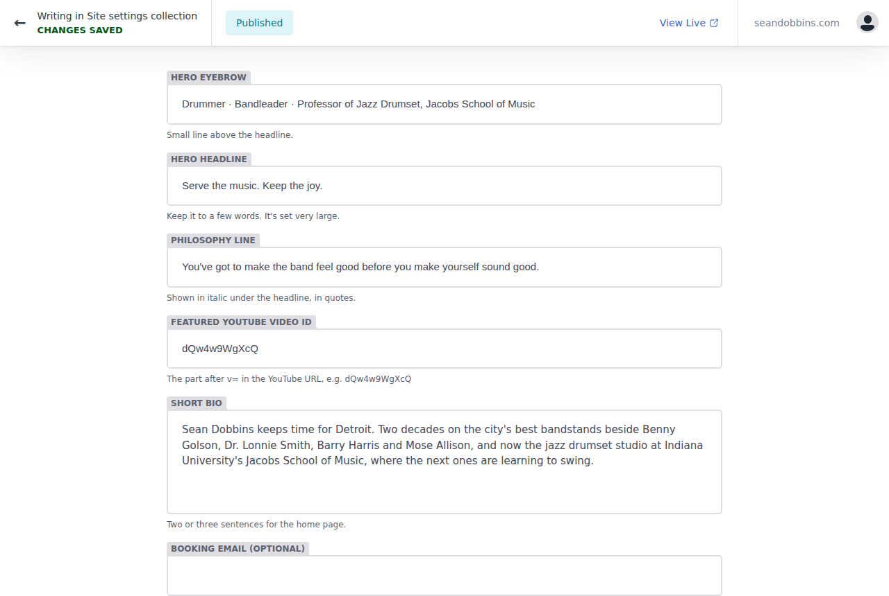

# Editing seandobbins.com — a guide for Sean

Everything you need to change on the site lives in one place: **https://seandobbins.com/admin/**
You never need to touch code. You log in with your GitHub account, click, type, upload, and press **Publish**. The site rebuilds itself in two or three minutes.

If anything looks wrong or you get stuck, email Dana. Nothing you do in the editor can break the site.

---

## 1. Logging in

1. Go to **seandobbins.com/admin/** (the "Edit site" link in the site footer goes there too).
2. Click **Login**. A GitHub window opens; approve it. You only do this the first time on each device.



You land on the **Collections** screen. The left sidebar is everything you can edit:



| Section | What it controls |
|---|---|
| **Resources** | The free PDFs in The Barbershop library |
| **Testimonials** | Quotes from students, parents and bandleaders (Barbershop page) |
| **Outreach** | Clinics, masterclasses, residencies (Outreach page, grouped by region) |
| **Announcements** | The blue strip on the home page under the video |
| **Site settings** | Home page headline, philosophy line, featured video, short bio |

---

## 2. Adding a new resource (the main job)

1. Click **Resources** in the sidebar, then the dark **+ Resource** button.
2. Fill in the form:



   - **Title**: short and specific. Shows on the card. Example: *Brushes: The First Week*.
   - **URL slug**: lowercase words joined with hyphens, e.g. `brushes-first-week`. This becomes the web address. Don't change it once it's published.
   - **Description**: one or two sentences. What it is, who it's for.
   - **Topic**: pick one from the list. Visitors filter by it.
   - **PDF**: click **Choose a file**, then **Upload** (top right of the media window) and pick the PDF from your computer. Give the file a sensible name before uploading (`brushes-first-week.pdf`, not `final_v3 (2).pdf`).
   - **Cover image** (optional): a portrait-shaped image (taller than wide, about 800 × 1000 pixels). Leave it empty and the site shows a blue placeholder.
   - **Published date**: today, usually. Newest shows first.
   - **Featured**: switch on for the one you want at the top of the home page.
   - **More about this resource** (optional): longer notes shown on the resource's own page.
3. Press **Publish** (top of the page) → **Publish now**.
4. Wait two or three minutes, then check **seandobbins.com/barbershop/resources**.

That's it. The email gate, the download link and the MailerLite tagging all happen automatically.

Here is an existing resource open for editing, so you can see what a finished one looks like:



**To edit** a resource: click Resources, click the one you want, change what you need, press Publish.
**To remove** one: open it and click **Delete entry**.

---

## 3. Testimonials

Sidebar → **Testimonials** → **+ Testimonial**.



- **Name** and **Role** ("Jacobs alum, 2019", "Parent, Ann Arbor Summer Jazz Program").
- **Quote**: two or three sentences in the person's own words.
- **Photo**: optional square headshot.
- **Order**: lower numbers show first. Leave at 50 if you don't care.

The site launched with three **placeholder** testimonials. Replace or delete them.

---

## 4. Outreach

Sidebar → **Outreach** → **+ Outreach entry**. One entry per visit.



- **Institution**, **City** (e.g. "Bloomington, IN" or "Paris"), **Country**, **Year**.
- **Region**: this decides which group it appears under on the page (Midwest, Europe, Asia & Pacific, and so on).
- **Type**: Clinic, Masterclass, Residency, Concert, Faculty or Festival.
- **Note**: one line, optional.

Three entries are marked **SAMPLE — Replace me**. Delete them when you have real ones.

---

## 5. Announcements

Sidebar → **Announcements** → **+ Announcement**. The newest one (by date) shows in the blue strip on the home page. **Link** is where it goes when clicked (`/gigs`, `/barbershop/resources`, or a full web address).

---

## 6. Site settings (home page)

Sidebar → **Site settings** → **Home page**.



- **Hero tagline**: the italic line under the name on the home page. **Philosophy headline**: a few words for the blue band under the photo.
- **Featured YouTube video ID**: the part after `v=` in a YouTube link. For `https://www.youtube.com/watch?v=abc123XYZ` the ID is `abc123XYZ`.
- **Short bio**: two or three sentences for the home page.
- **Booking email**: fill this in to show it on the contact page.

---

## Good to know

- **Publish is the only button that matters.** Until you press it, nothing changes on the live site.
- **Wait a few minutes** after publishing. If it still looks old, refresh the page.
- **Images**: JPG or PNG, under 2 MB. Portrait for resource covers, square for headshots.
- **PDFs**: anything up to about 20 MB is fine.
- **Don't rename or delete files in the Media tab** unless you know nothing uses them.
- Everything you publish is saved forever in the site's history, so mistakes can always be undone by Dana.

---
---

# For Dana — setup and wiring

## One-time setup on Vercel

1. Import the GitHub repo `vocalsbydana/seandobbins` into Vercel. Framework preset: **Astro**. Build command `npm run build`, output handled by the adapter. Node 22.
2. **Environment variables** (Project → Settings → Environment Variables). Copy from `.env.example`:
   - `SITE_URL` — the final domain, e.g. `https://seandobbins.com`.
   - `DOWNLOAD_SECRET` — any long random string. Signs the unlock cookie and hashes PDF paths. Rotating it logs every visitor out of the library.
   - `MAILERLITE_API_KEY`, `MAILERLITE_GROUP_DRUMMERS`, `MAILERLITE_GROUP_PROSPECTIVE`.
   - `RESEND_API_KEY`, `CONTACT_TO_EMAIL`, `CONTACT_FROM_EMAIL` (contact form; see below).
   - `OAUTH_GITHUB_CLIENT_ID`, `OAUTH_GITHUB_CLIENT_SECRET` (CMS login; see below).
3. Point the domain at Vercel. Update `base_url`, `site_url` and `display_url` in `public/admin/config.yml` and `Sitemap:` in `public/robots.txt` if the domain is not `seandobbins.com`.

## CMS login (GitHub OAuth app)

Decap logs Sean in with GitHub. It needs an OAuth app, ideally registered under **Sean's** GitHub account (or a shared org) so it doesn't depend on yours.

1. GitHub → Settings → Developer settings → OAuth Apps → **New OAuth App**.
   - Homepage URL: `https://seandobbins.com`
   - Authorization callback URL: `https://seandobbins.com/api/callback`
2. Copy the Client ID and generate a Client Secret → Vercel env vars above.
3. Sean's GitHub account must have **write** access to the repo (Settings → Collaborators).
4. Test at `/admin/`. The flow is `/api/auth` → GitHub → `/api/callback` → token handed to the CMS window.

Saves commit straight to `main` (simple workflow). If you'd rather review Sean's edits as pull requests first, set `publish_mode: editorial_workflow` in `config.yml`; he then gets a Drafts → In review → Ready board.

## MailerLite

1. Integrations → Developer API → generate a token → `MAILERLITE_API_KEY`.
2. Create two groups: **drummers** and **prospective-students**. Open each; the numeric ID in the URL is the group ID.
3. Create custom subscriber fields (Subscribers → Fields): `name` exists already; add `source`, `first_resource`, `last_resource`, `program`, `entry_year`, `city`, `note`. Names must match exactly (lowercase).
4. Turn on **double opt-in** if you want MailerLite to send the confirmation email (Settings → Subscribe settings). The site never sends mail itself.
5. Free tier: 1,000 subscribers. Beyond that MailerLite is paid regardless of the site.

Without the API key the gate still unlocks downloads (so the site never breaks) but records nobody; the function logs a warning.

## Contact form (Resend)

`/api/contact` sends via Resend's free tier (3,000 emails/month, 100/day). Create an account, verify the sending domain, create an API key, set `RESEND_API_KEY`, `CONTACT_TO_EMAIL` (Sean's inbox) and `CONTACT_FROM_EMAIL` (an address on the verified domain). Until set, the form shows "not set up yet". Alternatives with the same shape: Web3Forms, Formspree. Swap the fetch call in `src/pages/api/contact.ts`.

## Auralis (gigs)

`src/components/AuralisFeed.astro` is the placeholder. It reads `src/data/gigs.sample.json` and renders hairline event rows with an add-to-calendar `.ics` link each. Replace the data source with the Auralis embed or API; keep the `{ id, title, venue, city, start, end?, url?, cta? }` shape and everything else (home page "Next up", gigs page, calendar links) keeps working. Sample dates are fake.

## Placeholders to replace

- `src/content/settings/site.json` → `featuredYoutubeId` (currently a dummy ID).
- `src/data/music.json` → video IDs, streaming links, discography.
- `src/data/social.json` → profile URLs. Spotify is linked; the rest show dimmed with a "coming soon" tooltip until filled in. Set `showUnlinked` to false before launch to hide any still-empty icons. Logos are Simple Icons (CC0) in `src/data/social-icons.json`.
- `src/data/jacobs.json` → verify the official IU links.
- `src/pages/barbershop/index.astro` → the "How Sean teaches" draft copy (marked DRAFT COPY on the page).
- `src/pages/about.astro` → one `[TODO]` in the bio: the "Southeastern Michigan …" organization name was cut off in the source.
- Testimonials (3 placeholders) and Outreach (3 SAMPLE entries) → Sean, via the CMS.
- The sixth photo (square profile with the Regal Tip stick) never made it into the repo; drop it into `src/assets/photos/` when you have it.
- Spelling normalised from the source bio: Rodney Whitaker, Cyrus Chestnut, Johnnie Bassett. Change back if Sean prefers the originals.

## How the email gate works (for debugging)

1. Card/detail button has `data-download="<slug>"`. If the `barbershop_unlocked` cookie exists, the browser goes straight to `/api/download?slug=…`. Otherwise the modal opens.
2. Modal → `POST /api/subscribe` (honeypot `hp`, in-memory rate limit per IP). On success the response sets the signed cookie (2 years) and the browser navigates to `/api/download`.
3. `/api/download` verifies the HMAC, then 302s to `/files/<sha256(slug:DOWNLOAD_SECRET)[0:32]>.pdf`.
4. `scripts/hash-pdfs.mjs` (runs as `prebuild`) copies `private/resources/*.pdf` to `public/files/<hash>.pdf`. `public/files` is git-ignored; it's regenerated on every build. Cards never contain the real path.

A forged cookie bounces to the resource page with `?locked=1`, which reopens the modal.

## Local development

```
cp .env.example .env      # fill in what you have; the site runs without any of it
npm install
npm run dev               # http://localhost:4321
npx decap-server          # optional: CMS at /admin/ against the local files, no GitHub login
npm run build && npm run check
```

## Ongoing-cost / dependence flags

- Vercel Hobby: fine for this traffic. Serverless functions and build minutes are well within limits. Decap loads from unpkg (free CDN).
- The GitHub OAuth app and Vercel project are the two things tied to an account. Put the OAuth app under Sean's GitHub; Vercel stays with you unless you transfer it.
- Rotating `DOWNLOAD_SECRET` or MailerLite keys is the one maintenance task Sean cannot do alone.
